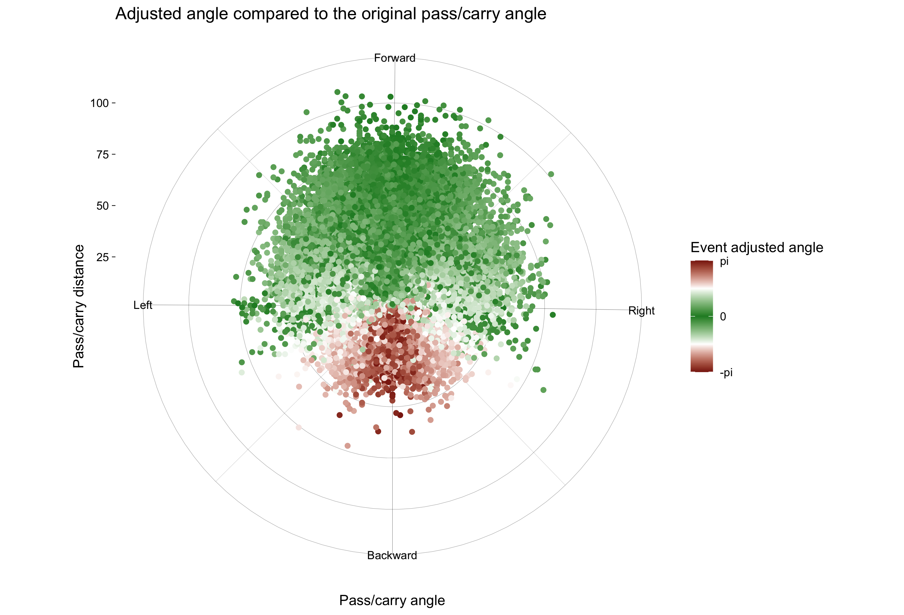

# Football playing style analysis

This project is about building playing style indicators in order to analyse players and teams performance in the football field. I'm using R, the first programming language I was confident with before learning a lot of Python.

As other projects, I started this one during the first French lockdown due to COVID-19, but my master's degree schedule didn't give me much time to continue it properly. Now that I'm more fluent in Python, I would like to maintain this project with Python programming language.

## Load data

Thanks to [StatsBomb](https://statsbomb.com), a lot of events open data are easily available. For this project, I'll use the FIFA World Cup 2018 matches.

The file [00_download.R](00_download.R) is doing what it says: downloading the data from [StatsBomb API](https://statsbomb.com/academy/) and storing it in a *.csv* database file. On the same time, I'm processing players playing time of each match and tactical formation in order to normalize players performance indicators in the future.

## Direct Play

The first playing style I want to process is the direct play. This is an attacking style, that we can define by the ability of a player or a team to play in direction of the opposite goal. Let's call $\mathbf{D}$ the direct play index of a player when he pass or carry the ball from a position of the field to another.

$$\mathbf{D} = \Delta \times \Theta \times \alpha$$

with:
- $\Delta = \| x \|_2^2$: the distance between the origin and the final position of the pass-carry event (with $x$ the vector containing the distances covered by the event on the X and Y axis of the field);
- $\Theta$: a penalty based on the cosinus value of the adjusted angle $\widehat{TOF}$, where the point $T$ is the position of the target (opposite goal), $O$ the origin position of the pass-carry event and $F$ the final position of the pass-carry event;
- $\alpha$: a logitic penalty coefficient for the pass-carry event in direction of the opponent goal but for which $\Delta$ is longer than the distance separating the origin position of the event and the position of the opponent goal.

### Why an adjusted angle?

I wanted to use a metric more relevant than the number of meters won thanks to a pass or carrying the ball. This kind of metric mostly use the difference between the final and the origin position of an event on the X axis only, because of the direction of the game.

But we defined the direct play by the ability of playing in direction of the target, so the X axis is not enough. In fact, a cross is a direct play, but the distance covered on the X axis is most of time lower than the one covered on the Y axis. Considering the position the origin position of the player, relatively to the target allow me to better use the context of the event when it occured.

The above plot shows the difference between a simple angle and an adjusted angle. The X polar axis represent the simple angle, the Y polar axis represent the distance covered by the ball during the pass-carry, and the color scale represent the adjusted angle: the greener it is, the more it is in direction of the target, inversely for red. The direction *Forward*, *Right*, *Backward* and *Left* refer to a field point of view: *Forward* means in direction of the opposite goal line, *Backward* means in direction of the own player goal line, *Left* and *Right* in direction of the touch lines.

Thanks to this representation, crosses and corners kicks got a lower penalty $\Theta$ compared to other pass-carry event going in the same direction, but performed much more far from the target.

### How this metric look like?

Finally, we can see the result of this metric above. As the previous plot, each point represent the final position of the pass-carry event from the player position point of view (player-centered).

Of course, the longer the pass-carry event is, the more important is the direct play index. However, some of the green dots are a little bit lighter than their neighbourhood, which means that with a slighty different adjusted angle and covered distance, they got a lower direct play index. This is because of the $\alpha$ value, penalizing too long pass-carry events. Also, we can see the effect of the adjusted angle allowing pass-carry event having a direction parallel to the opponent goal line to have a better direct play index, which wouldn't be the case if I use only the distance covered on the X axis.

## Other playing style

I started to work on other playing style, like quantifying counter attack index based on the speed to reach the opponent area after recovering the ball, or build-up and maintenance playing style, based on the time spent in different area of the field.

Because of lack of time, I couldn't work on it very much... But if you are curious and not afraid to put your nose in the code, it is in the file [01_processing.R](01_processing.R), as the computation of direct play index.

# To be continued...